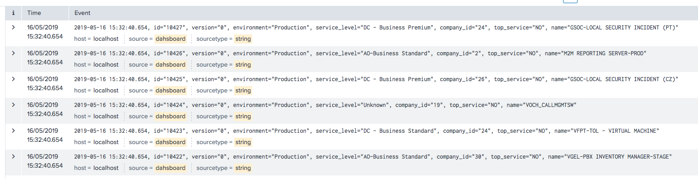
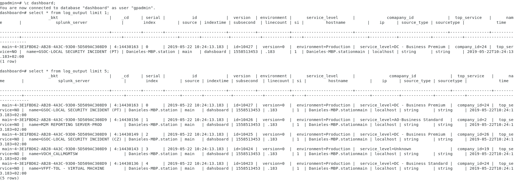

## Summary
This software is intended to show how it is possible to integrate Splunk with Greenplum database. It exercises splunk java api 
to make searches or to take all logs stored in Splunk and be able to query them also from Greenplum using external tables  
This software continues the experiment done here:  
https://github.com/DanielePalaia/gpss-splunk  
A java script is created, this script is connecting to splunk and printing in consolle splunk logs. The idea is that every host search for a different date range in order to work in parallel.
Then, the script can be embedded in a external web table definition.

## Prerequisites:
### 1. Bring some data to Splunk: 
I used a DBMS to bring some data into Splunk. I used DBConnect to bring some Greenplum/Postgresql into Splunk. Here you can follow the istructions:   
https://subscription.packtpub.com/book/big_data_and_business_intelligence/9781788835237/1/ch01lvl1sec18/getting-data-from-databases-using-db-connect  
The data I put into Splunk are of this type:   
dashboard=# select * from services limit 5;   
  id  | version | environment  |     service_level      | company_id | top_service |             name               
------+---------+--------------+------------------------+------------+-------------+------------------------------  
 2052 |       0 | Production   | DC - Basic             |          7 | NO          | IE-PCAT PRODUCTION-PROD  
 2053 |       0 | Unknown-null | DC - Mission Critical  |         45 | NO          | ARCOR SERVERHOUSING  
 2054 |       0 | Production   | DC - Business Standard |         37 | NO          | DE-NSS ATOLL-BE DB SYBASE  
 2055 |       0 | Unknown-null | DC - Business Standard |         49 | NO          | VFUK INFRASTRUCTURE SECURITY  
 2056 |       0 | Unknown-null | DC - Business Standard |         42 | NO          | SHARED KPI MEASURING  
  
Once loaded into splunk it will start to generate events and you will start to see logs like this:

### 2. Create a Greenplum external web table:
Taking in account all informations contained in a splunk log, create an external web table like this: 

CREATE EXTERNAL WEB TABLE log_output
    (_bkt text, _cd text, serial text, id text, version text, environment text, service_level text, comapany_id text, top_service text, name text, splunk_server text, index text, source text, indextime text, subsecond text, linecount text, si text, hostname text, ip text, source_type text, sourceType text, time text)
    EXECUTE '/home/gpadmin/splunk_data.sh' ON HOST
    FORMAT 'CSV';
      
For semplicity I put all fields as text but you can put the data type you want accodingly to the info received
 

    
### 3. The software is written in Java so you need a JVM installed as well as Splunk
Java needs to be installed on every host of the Greenplum distributed system   
In every segment host, you need also to create a .splunkrc  in your home directory specifying connection parameters like:    

host=localhost   
#Splunk admin port (default: 8089)   
port=8089     
#Splunk username   
username=daniele   
#Splunk password   
password=XXXXXX   
#Access scheme (default: https)   
scheme=https  
#Splunk version number   
version=7.2.6   
  
 
## Running the software:
### 1. Configuration file:    
In every segment host you need to specify a segment.properties file where you specify this parameters:   
**earliest:2019-05-21T00:00:00**  
**latest:2019-05-21T23:59:00**  

The idea is to specify different time range in different hosts.

### 2. Run the jar  
Copy the .jar /target/splunk-0.0.1-SNAPSHOT.jar in /home/gpadmin  
Create a /home/gpadmin/splunk_data.sh where you simply call the .jar 

java -jar /home/gpadmin/splunk-0.0.1-SNAPSHOT.jar "search * | head 100" 
In this case will take just the first 100 elements but you can specify more

### 5. Have a look to the external table specified   
Just do a SELECT * FROM log_output;
Then the /home/gpadmin/splunk_data.sh which is connecting to splunk and display csv lines will be invoked in order to see in a structured way: 
dashboard=# select * from log_output limit 5;  

### 6. Limitations:   
Currently just one segment per host will work. Not fully tested on multiple segments.

## Compiling the software:

**If you wish to compile the software you can just mvn install on the root directory**  
**Jar file will be produced inside /target**
